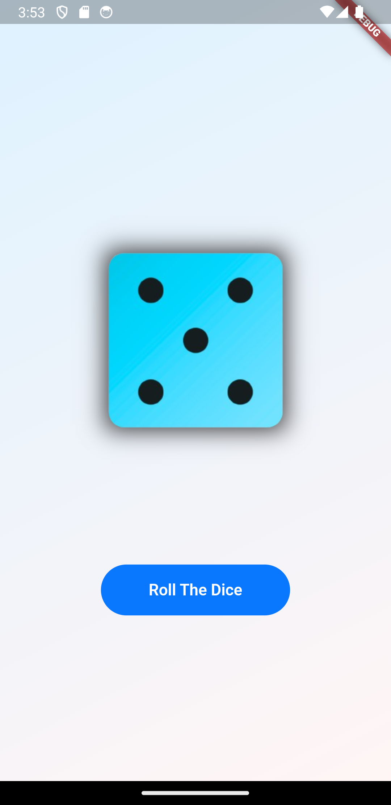

# Dice Roller App

Welcome to the Dice Roller App, a simple yet engaging Flutter application designed to simulate the rolling of a dice with a single click. This project serves as a demonstration of Flutter's capabilities in creating interactive and visually appealing applications. Whether you are a beginner looking to understand the basics of Flutter or an experienced developer exploring new ideas, this app provides a clear and concise example of state management, animation, and user interface design in Flutter.

Within this project, you will find a comprehensive display of my approach to creating a fun and interactive user experience. Each feature is thoughtfully implemented to ensure a smooth and engaging experience, showcasing my attention to detail and commitment to quality.

As you explore the Dice Roller App, you will get to know me—not just as a developer, but as a creative thinker and problem solver. This project embodies my passion for combining technology and creativity to deliver delightful user experiences.

## Highlights

🎲 **Interactive Dice Rolling**: Tap the screen to roll the dice, generating a random number between 1 and 6, accompanied by a smooth animation that enhances the user experience.

🎨 **Beautiful UI**: The application features a clean and intuitive interface, making it easy for users of all ages to enjoy.

🚀 **Smooth Animations**: Utilizes Flutter's animation capabilities to provide a visually pleasing rolling effect that mimics a real dice roll.

📱 **Responsive Design**: Ensures a consistent and engaging experience across different devices and screen sizes.

## Technologies

Built with Flutter, this application leverages a modern and efficient tech stack to ensure optimal performance and maintainability:

